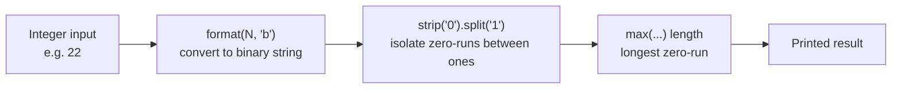

# Binary Gap

A tiny single-file Python script that calculates the "binary gap" of an integer — the length of the longest run of consecutive zeros between two ones in the number's binary representation. It defines a `Final` class with a `binary_gap` method and demonstrates it on the sample inputs `[2, 22, 34]`.

## Tech stack

- Python (standard library only, no dependencies)

## Architecture



## How to run

The script has no external dependencies. Run it directly with Python:

```
python Binary_Gap.py
```

This prints the binary gap for each value in the hardcoded list `[2, 22, 34]`. To test other numbers, edit the `x` list in the script.
